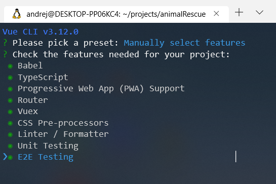
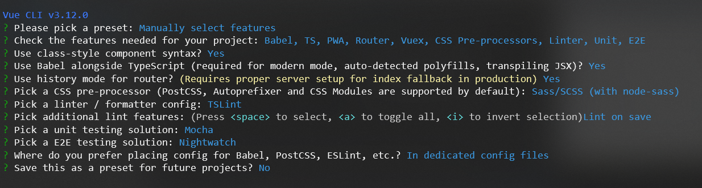
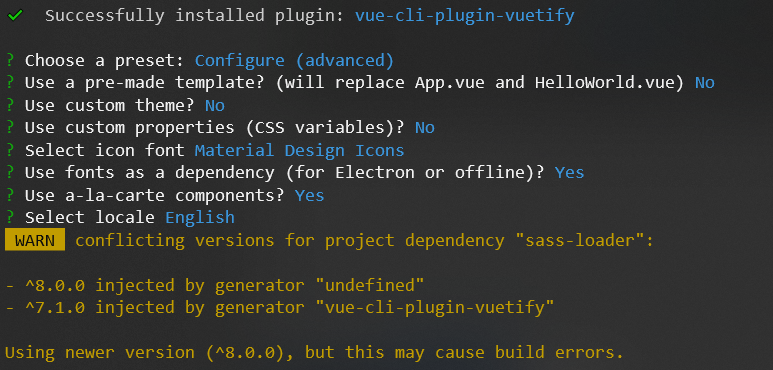
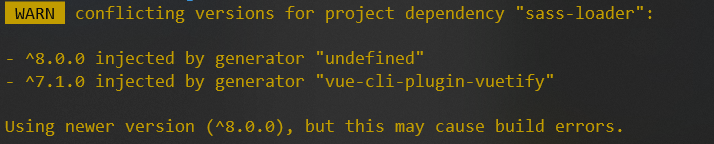

# Installation guide

## Prerequisite for this guide
  - [Node.js](https://nodejs.org/en/download/) (v10.16.3 used) with NPM (6.9.0 used) installed
  - [Vue CLI](https://cli.vuejs.org/guide/installation.html) installed globally
  - Linux (Ubuntu 18.04 LTS used)

### Check Node.js version
```sh
$ node -v
v10.16.3
```

### Check NPM version
```sh
$ npm -v
6.9.0
```

### Check Vue CLI version
```sh
$ vue --version
3.12.0
```

## Setup new project

### [1. Create new project](https://cli.vuejs.org/guide/creating-a-project.html)
```sh
$ mkdir animalrescue-folder
$ cd animalrescue-folder
$ vue create animalrescue-ui
```

### 2. Choose the default preset
Use this option during installation
```sh
❯ Manually select features
```
Select all features. Press `Space` to select feature.



Then you can continue pressing `Enter` to confirm selected features.

Select this options:



### [3. Install Vuetify](https://vuetifyjs.com/en/getting-started/quick-start)

```sh
$ cd animalrescue-ui
$ vue add vuetify
```



### 4. Edit tsconfig.json
Edit file `tsconfig.json` and add value `"vuetify"` to `types` array
```json
"types": [
    "webpack-env",
    "mocha",
    "chai",
    "vuetify"
],
```

Reason why you have to do it you can find [here](https://github.com/vuetifyjs/vue-cli-plugin-vuetify/issues/43).
### 5. Change package.json if needed
If you get this warning during Vuetify installation:



Change sass-loader from version `^8.0.0` to version `^7.1.0` in `package.json` file:
```json
"sass-loader": "^7.1.0",
```
Then run this command:
```sh
$ npm install
```

### 6. Run project
To build and run your project type
```sh
$ npm run serve
```
